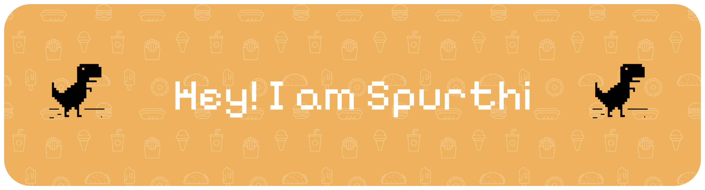

 

## 🌸 About Me

- 🔭 Currently working on a mix of projects — a little web, a little data, a little of everything
- 🌱 Always picking up something new
- 💬 Ask me about anything code-related, happy to chat
- ⚡ Fun fact: I love turning small ideas into fun little builds

 
